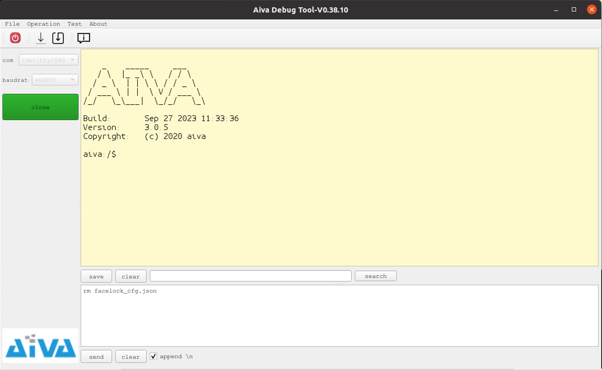
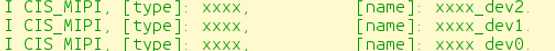

# 使用新的Sensor

## 1. 编译烧写一个只包含基本shell的固件，如下图所示



可以通过类似的逻辑实现此固件
```cpp
int xxx_main()
{
    //mount fs
    if (mount_fs)
        os_mount_fs_2();

    //start shell
    if (start_shell)
        os_shell_app_entry();

    return 0;
}
```

## 2. 根据在新sensor驱动中export的sensor name, 在shell中敲入mono_uvc命令，在弹出的提示中查看是否有对应的sensor name,如果有，则证明export sensor成功


## 3. 使用命令mono_uvc start sensor_ID sensor_name启动uvc
举例如下：
键入命令mono_uvc start 0 xxxx
则会查找xxxx_dev0设备并启动

键入命令mono_uvc start 2 xxxx
则会查找xxxx_dev2设备并启动


## 4. 使用图像工具查看是否有图像出现

### （1）如果sensor的I2C读写过程有问题，则需要检查硬件配置中的I2C设备号和地址是否正确

### （2）如果没有图像，则需要查看包括硬件配置、命令参数在内的各项参数是否正确

### （3）如果有图像，但图像输出不正确，此时一般需要查看sensor FAE给出的配置是否正确
