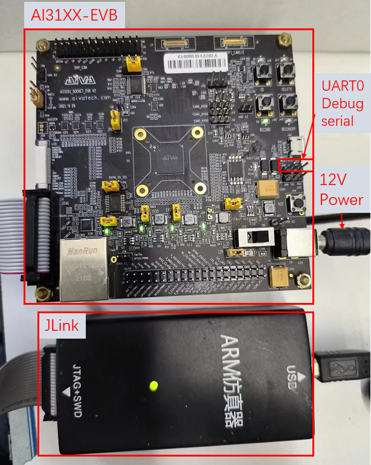
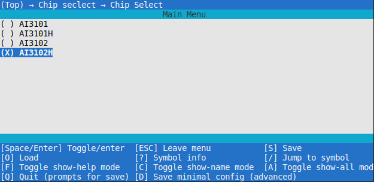
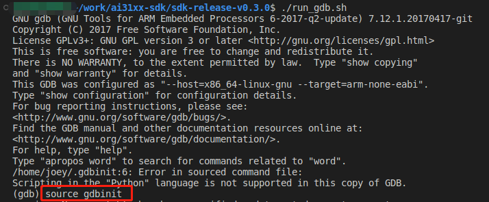
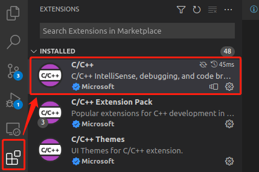
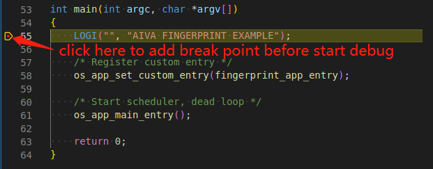
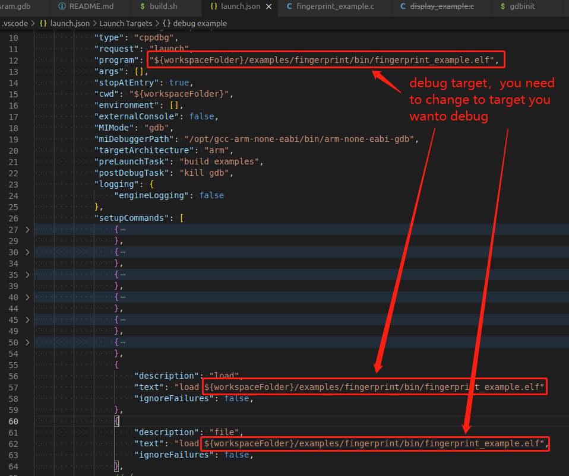
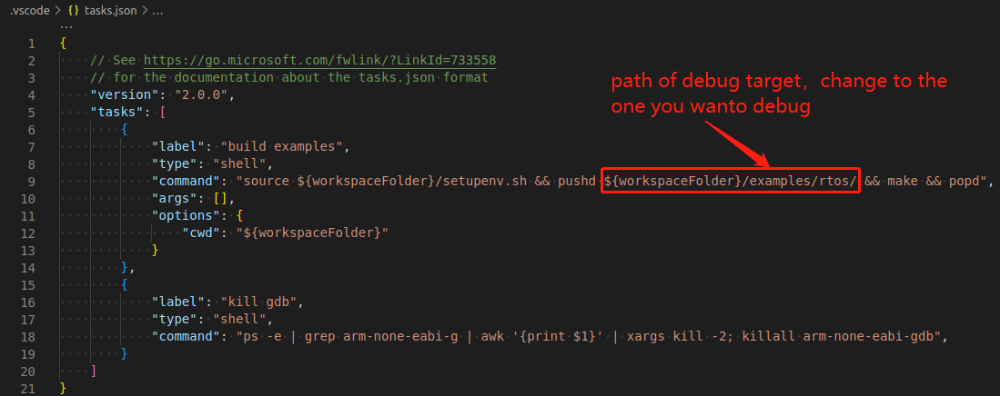
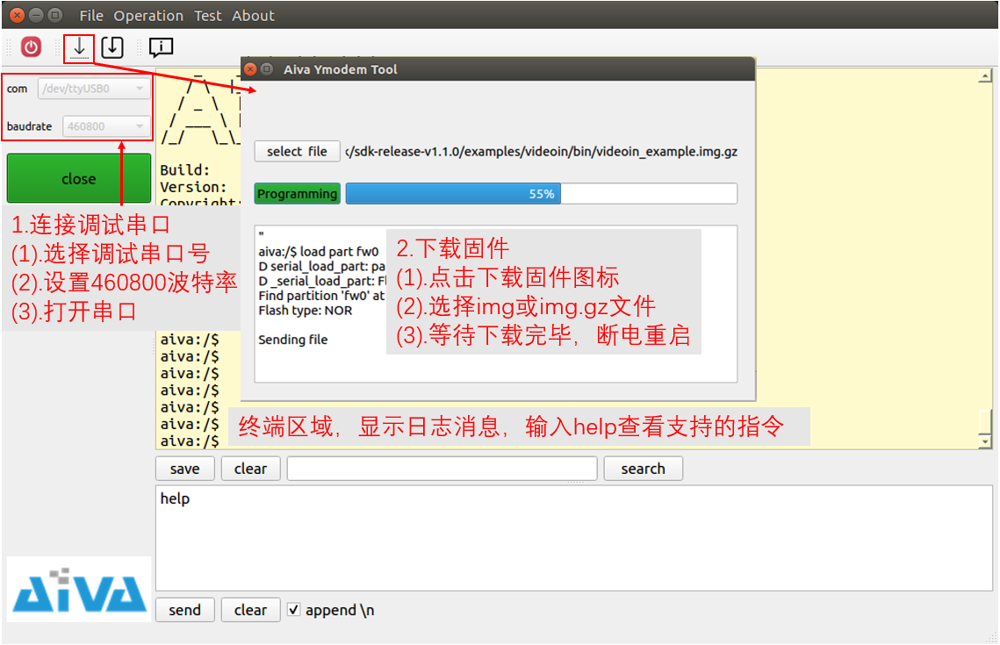

# ai31xx-sdk 快速入门

## 1. 准备环境

### (1) 安装交叉编译环境

- 下载Linux版本的交叉编译工具链 [gcc-arm-none-eabi-6-2017-q2-update](https://developer.arm.com/downloads/-/gnu-rm)

- 解压缩安装包并安装交叉编译工具链到该路径下 `/opt/gcc-arm-none-eabi` 参考如下目录结构，并添加环境变量

```bash
/opt/gcc-arm-none-eabi/
├── arm-none-eabi
├── bin
├── gcc-arm-none-eabi -> ./gcc-arm-none-eabi
├── lib
└── share
```
```bash
    vim ~/.bashrc
    export PATH=/opt/gcc-arm-none-eabi/bin:$PATH
```

### (2) 安装JLink驱动

- 下载驱动 [JLink server](https://www.segger.com/downloads/jlink/)推荐下载deb格式的（双击直接安装）

- 安装到该路径下 `/opt/SEGGER/JLink`

### (3) 准备 AI31XX-EVB

- 连接AI31XX评估板: 12V直流电源适配器; 连接JLink硬件，并且启动JLink程序

- 将串口线连接到EVB板子上的UART0上，查看SoC输出日志（默认使用UART0输出日志）



## 2. build example

- 切换到目标example目录下

```bash
cd examples/rtos # 假设编译RTOS的例子
```

- 选择对应的芯片类型通过 `make menuconfig`


- build example

```bash
make clean && make # build rtos example
```

## 3. 使用gdb调试

将JLink与PC和EVB板子连接

```bash
# 启动jlink server
./run_jlink.sh # 切换到SDK的根目录，并且运行该脚本
./run_gdb.sh    # 打开另一个shell终端，运行该脚本
```

将调试固件下载到RAM中运行


```bash
source gdbinit # 在GDB终端输入该命令, 下载完成调试固件后，可以GDB调试该固件
```

## 4. 使用vscode调试 (optional)

> 使用VSCode调试需要配置在调试模式(`CONFIG_DEBUG=y`)，可以通过make menuconfig配置该选项

启动jlink server

```bash
# 启动 jlink server
./run_jlink.sh
```

安装 c++ debug的VSCode插件



添加断点



`press F5` 启动调试; 在.vscode中的脚本指定下载的调试固件

> 自定义调试固件在.vscode/launch.json文件中



> 也可以选择默认编译的例子 .vscode/launch.json



## 5. 使用工具查看日志并且下载固件 [aiva-debug-tool](https://pan.baidu.com/s/1GgQCYckZGgYJliBEERgjPA)

- 连接串口设备到EVB板子的UART0上，默认输出日志以及OTA都使用UART0 
- 使用工具aiva-debug-tool打开串口设备，查看输出日志以及固件升级（OTA）
- 请确保shell命令"upload"包含在固件中（在sdk中使用menuconfig查看是否配置，以及在EVB板子输出日志控制台使用help命令查看）


