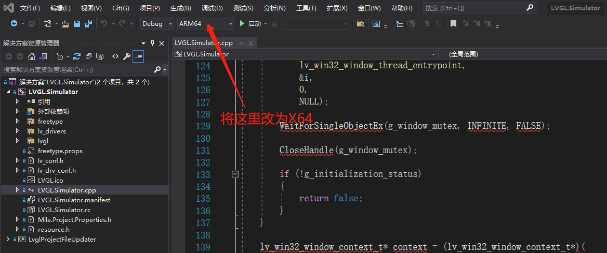

# LVGL接口

## 概述

    LVGL(Light and Versatile Graphics Library) 是最流行的免费开源嵌入式图形库，已经将LVGL-v8.3.9源码作为sdk一部分，存放在sdk/components/gui目录下；根据实验需求，移植了部分驱动；目前已验证i80_st7365p设备，并使用Videoin接口与LVGL框架进行耦合；
    SDK中已经包含了LVGL的源码，并且在sdk目录下example/lvgl目录中包含有相关的使用例程，移植官方benchmark例子。

## LVGL参考资料说明

### 中文参考
   <https://lvgl-chinese-doc.readthedocs.io/zh_CN/latest/overview/index.html>

### LVGL官方参考资料
   <https://lvgl.io/get-started>

## SDK LVGL说明

#### LVGL初始化显示设备

#### 描述
    根据传入的显示设备，LVGL初始化显示设备，并尝试初始化输入设备

#### 函数定义
```c
    void lv_port_and_display_init(display_handle_t handler)
```

#### 参数
| 参数名称      | 描述          | 输入输出  |
| :------      | ----------    | -------- |
| handler      | 显示设备的句柄 | 输入      |

#### 返回值
    无

#### LVGL初始化输入设备

    在路径lvgl/porting/lv_port_indev.c文件下
```c
    void lv_port_indev_init(void)
```
    根据需要实现相关输入设备的初始化；

#### LVGL参数修改
    在文件lvgl/lv_config.h中，参数修改包括，像素点深度，显示屏幕的尺寸，是否屏幕旋转，以及自定义相关参数；

## SDK example说明
    通过display接口，初始化显示设备屏幕设备（i80_st7365p），并将display接口的句柄传入lvgl初始化接口，在初始化接口（lv_port_and_display_init）中，根据需要初始化相关设备；详细信息见sdk/example/lvgl使用例子
```c
    // init display device.
    static const char *dev_name = "i80_st7365p";
    display_handle_t handle = display_init(DISPLAY_INTERFACE_TYPE_I80, dev_name);
    // init lvgl with display dev.
    lv_port_and_display_init(handle);
    // lvgl官方例子benchmark
    lv_demo_benchmark();
    while (1) {
        lv_tick_inc(1);
        lv_task_handler();
        aiva_msleep(1);
    }
```

## LVGL windows环境仿真
    在windows环境推荐在visual_studio搭建仿真环境，仿真可完全移植到目标板子上运行
```bash
    git clone --recurse-submodules https://github.com/lvgl/lv_sim_visual_studio.git
    cd lv_sim_visual_studio/
    git submodule init
    git submodule update --recursive
```
### 编译LVGL
    使用visual_studio打开LVGL_Simulator.sln，修改如下选项，并编译
   


