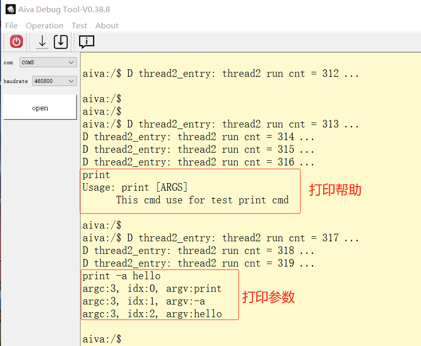

# 自定义SHELL命令

## 概述

    SHELL模块以Components的形式对外开放，包括sdk中已经存在的cmd，详细命令实现见sdk/components/shell_utils下；shell命令类似udevice模块，将实现的接口重定向到自定义的section中；SHELL模块使用SHELL_EXPORT_CMD()宏来实现；
    SDK中已经包含有相关cmd实现，因此这里参考已经实现的cmd，来添加一个新的SHELL命令；这里暂不讨论SHELL结构实现的具体数据结构；

## CMD参考

    参考cmds_ls.c实现的print命令

## 实现目标

    自定义命令print，打印该命令跟随的所有参数，以打印的方式确保我们自定义的命令可以正确执行；
    例：print -s hello

## 实现如下
### Step1 拷贝cmds_ls.c为cmds_print.c

    通过分析可以看到cmds_ls为当前命令的入口，并且参数列表中包含命令后跟随的参数列表；
    分析宏定义SHELL_EXPORT_CMD(_attr, _name, _func, _desc)如下：
| 参数名称     | 描述                   | 输入输出 |
| :----------- | ---------------------- | -------- |
| _attr     | 命令的属性 | 输入     |
| _name     | 命令名称   | 输入     |
| _func     | 实现命令的入口参数   | 输入     |
| _desc     | 命令描述   | 输入     |

### Step2 修改cmds_print.c

    删除不相关的代码，以及修改目标名称，修改如下
#### 包含的头文件
```c
    #include "shell.h"
    #include "FreeRTOS.h"
    #include "FreeRTOS_POSIX.h"
    #include "FreeRTOS_POSIX/pthread.h"
    #include "FreeRTOS_POSIX/mqueue.h"
    #include "FreeRTOS_POSIX/time.h"
    #include "FreeRTOS_POSIX/fcntl.h"
    #include "FreeRTOS_POSIX/errno.h"
    #include "FreeRTOS_POSIX_portable.h"
    #include <string.h>
    #include <stdio.h>
```
#### 命令入口函数
```c
    static void cmds_print_help(void)
    {
        Shell *shell = shellGetCurrent();
        shellPrint(shell, "Usage: print [ARGS] \r\n"
                    "      This cmd use for test print cmd\r\n"
                );
    }

    void cmds_print(int argc, char *argv[])
    {
        Shell *shell = shellGetCurrent();
        if (argc == 1) {
            cmds_print_help();
            return ;
        }

        for(int i = 0; i < argc; i++) {
            shellPrint(shell, "argc:%d, idx:%d, argv:%s\r\n",argc, i, argv[i]);
        }
    }
```

#### 宏定义

```c
SHELL_EXPORT_CMD(
    SHELL_CMD_PERMISSION(0)|SHELL_CMD_TYPE(SHELL_TYPE_CMD_MAIN)|SHELL_CMD_DISABLE_RETURN,
    print, cmds_print, print);
```

### Step3 将cmds_print.c添加到当前目录的Makefile中
```shell
    SOURCE_LIB_C += $(SDK_ROOT)/components/shell_utils/cmds_print.c
```

### 编译及测试



### 其他shell命令说明

#### 在控制台使用help命令查看固件中所有命令的帮助信息
```bash
aiva:/$ help

Command List:
cat                   CMD   --------  cat
cd                    CMD   --------  cd
cp                    CMD   --------  cp
df                    CMD   --------  df
echo                  CMD   --------  write data to file
load                  CMD   --------  Load binary from serial port
ls                    CMD   --------  ls
ls_task               CMD   --------  list tasks
usb_acm_shell         CMD   --------  open acm shell to recv commands
part                  CMD   --------  Partition operations
pwd                   CMD   --------  pwd
reboot                CMD   --------  reboot
rm                    CMD   --------  rm
upload                CMD   --------  Upload binary from serial port
log_cfg               CMD   --------  config log output
exec                  CMD   --------  execute function undefined
clear                 CMD   --------  clear console
keys                  CMD   --------  list all key
vars                  CMD   --------  list all var
cmds                  CMD   --------  list all cmd
users                 CMD   --------  list all user
help                  CMD   --------  show command info
setVar                CMD   --------  set var
```

#### 其他命令说明
```bash
usb_acm_load          CMD   --------  use acm port OTA，类似load命令，使用USB模拟串口升级或者传输文件
usb_acm_upload        CMD   --------  use acm port download from board，类似upload命令，使用USB模拟的串口下载文件
```
