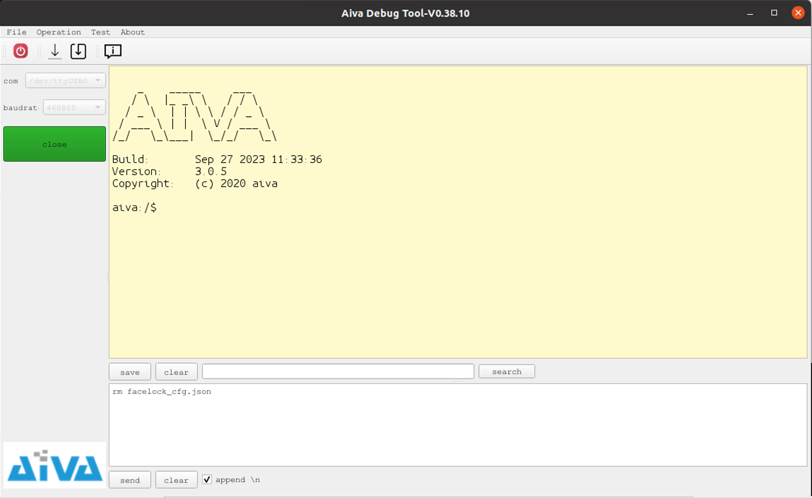
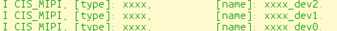

# 在SDK中添加新的Sensor

## 1. 根据原理图，确认sensor硬件连接

需确认的内容主要包括以下几项：
- I2C device number
- I2C target address
- power GPIO pin
- reset GPIO pin
- mclk ID
- mclk frequency

## 2. 根据上述获得的信息填充cis_dev_driver_t结构体

以某sensor实际使用场景作为案例，填充结构体后的代码如下：
```cpp
static cis_dev_driver_t xxxx_dev2 = {
    .name                   = "xxxx_dev2",
    .i2c_num                = I2C_DEVICE_2,
    .i2c_tar_addr           = SENSOR_ADDR_WR,
    .power_pin              = GPIO_PIN2,
    .reset_pin              = GPIO_PIN2,
    .mclk_id                = CIS_MCLK_ID_MCLK0,
    .mclk_freq              = 24 * 1000 * 1000,
    .fps                    = 15,
    .mf_mode                = 0,
    .context                = NULL,
    .init                   = cis_xxxx_init_common,
    .start_stream           = cis_xxxx_start_stream,
    .stop_stream            = cis_xxxx_stop_stream,
    .wake                   = cis_xxxx_wake,
    .sleep                  = cis_xxxx_sleep,    
    .power_on               = cis_xxxx_power_on,
    .power_off              = cis_xxxx_power_off,
    .reset                  = cis_xxxx_reset,
    .get_interface_param    = cis_xxxx_get_interface_param,
    .get_exposure_param     = cis_xxxx_get_exposure_param,
    .set_exposure           = cis_xxxx_set_exposure,
    .get_frame_parameter    = cis_xxxx_get_frame_parameter
};
```
## 3. 根据实际需要，确认sensor配置

根据实际需要向sensor厂商的FAE获取对应配置。为获得准确的sensor配置，一般来说，需提供给FAE以下参数：

- 图像分辨率
- 图像帧率
- 图像传输过程中使用的mipi lane数量（1或2）
- 图像源格式（raw8或raw10、raw12等）
- 如果是双sensor同时出图，确认是否需要进行主从sensor的同步

## 4. 填充对应的接口函数

示例代码如下：

### （1）init
主要负责初始化sensor，将FAE给出的配置写入到sensor
```cpp
static int cis_xxxx_init(const cis_dev_driver_t *dev_driver) {
    int ret;

    //enalbe sensor mclk, here is mclk_ID0
    sysctl_set_sens_mclk(MCLK_ID0, dev_driver->mclk_freq);
    sysctl_set_io_switch(IO_SWITCH_MCLK0, 1);

    //i2c init
    ret = i2c_init(dev_driver->i2c_num, dev_driver->i2c_tar_addr, 7, I2C_DEFAULT_SPEED);
    if (ret < 0) {
        LOGE(TAG, "sensor i2c init failed!");
        return ret;
    }

    ret = sensor_xxxx_write_registers_to_init(dev_driver);
    if (ret < 0) {
        LOGE(TAG, "sensor init failed!");
        return ret;
    }

    return 0;
};
```
### （2）start stream
启动sensor，开始输出mipi数据流
```cpp
static int cis_xxxx_start_stream(const cis_dev_driver_t *dev_driver)
{
    int ret;

    ret = i2c_init(dev_driver->i2c_num, dev_driver->i2c_tar_addr, 7, I2C_DEFAULT_SPEED);
    if (ret < 0) {
        LOGE(TAG, "sensor i2c init failed!");
        return ret;
    }

    ret = sensor_xxxx_write_registers_to_start_stream(dev_driver);
    if (ret < 0) {
        LOGE(TAG, "sensor start stream failed!");
        return ret;
    }

    return 0;
}
```

### （3）stop stream
停止sensor输出mipi数据流
```cpp
static int cis_xxxx_stop_stream(const cis_dev_driver_t *dev_driver)
{
    int ret;

    ret = i2c_init(dev_driver->i2c_num, dev_driver->i2c_tar_addr, 7, I2C_DEFAULT_SPEED);
    if (ret < 0) {
        LOGE(TAG, "sensor i2c init failed!");
        return ret;
    }

    ret = sensor_xxxx_write_registers_to_stop_stream(dev_driver);
    if (ret < 0) {
        LOGE(TAG, "sensor stop stream failed!");
        return ret;
    }

    return 0;
}
```

### （4）wake sensor
从睡眠状态中唤醒sensor
```cpp
static int cis_xxxx_wake_sensor(const cis_dev_driver_t *dev_driver)
{
    int ret;

    ret = i2c_init(dev_driver->i2c_num, dev_driver->i2c_tar_addr, 7, I2C_DEFAULT_SPEED);
    if (ret < 0) {
        LOGE(TAG, "sensor i2c init failed!");
        return ret;
    }

    ret = sensor_xxxx_write_registers_to_wake_sensor(dev_driver);
    if (ret < 0) {
        LOGE(TAG, "sensor wake failed!");
        return ret;
    }

    return 0;
}
```

### （5）sleep sensor
使sensor进入低功耗睡眠状态
```cpp
static int cis_xxxx_sleep_sensor(const cis_dev_driver_t *dev_driver)
{
    int ret;

    ret = i2c_init(dev_driver->i2c_num, dev_driver->i2c_tar_addr, 7, I2C_DEFAULT_SPEED);
    if (ret < 0) {
        LOGE(TAG, "sensor i2c init failed!");
        return ret;
    }

    ret = sensor_xxxx_write_registers_to_sleep_sensor(dev_driver);
    if (ret < 0) {
        LOGE(TAG, "sensor sleep failed!");
        return ret;
    }

    return 0;
}
```

### (6) power on
sensor硬件上电
```cpp
static void cis_xxxx_power_on(const cis_dev_driver_t *dev_driver)
{
    int power_pin = dev_driver->power_pin;

    gpio_set_drive_mode(power_pin, GPIO_DM_OUTPUT);
    gpio_set_pin(power_pin, GPIO_PV_LOW);
    aiva_msleep(3);
    gpio_set_pin(power_pin, GPIO_PV_HIGH);
    aiva_msleep(5);
    return;
}
```

### (7) power off
sensor硬件下电
```cpp
static void cis_xxxx_power_off(const cis_dev_driver_t *dev_driver)
{
    int power_pin = dev_driver->power_pin;

    gpio_set_drive_mode(power_pin, GPIO_DM_OUTPUT);
    gpio_set_pin(power_pin, GPIO_PV_LOW);
    aiva_msleep(5);
    return;
}
```

### (8) reset
sensor硬件复位
```cpp
static int cis_xxxx_reset(const cis_dev_driver_t *dev_driver)
{
    int reset_pin = dev_driver->reset_pin;

    gpio_set_drive_mode(reset_pin, GPIO_DM_OUTPUT);
    gpio_set_pin(reset_pin, GPIO_PV_LOW);
    aiva_msleep(3);
    gpio_set_pin(reset_pin, GPIO_PV_HIGH);
    aiva_msleep(5);
    return;
}
```

### (9) get interface param
获取sensor接口配置参数
```cpp
static int cis_xxxx_get_interface_param(const cis_dev_driver_t *dev_driver, cis_interface_param_t *param)
{
    param->interface_type  = CIS_INTERFACE_TYPE_MIPI;   //当前为MIPI接口
    param->mipi_param.freq = 660;   //与实际sensor配置对应
    param->mipi_param.lane_num = 1; //与实际sensor配置对应
    param->mipi_param.vc_num = 1;   //一般为1
    param->mipi_param.virtual_channels[0] = MIPI_VIRTUAL_CHANNEL_0;  //vc_num为1时，此处为channel0
    param->mipi_param.data_type = MIPI_DATA_TYPE_RAW_10; //与实际sensor配置对应
    return 0;
}
```

### (10) get exposure param
获取sensor允许的最大最小gain值、itime值
```cpp
static int cis_xxxx_get_exposure_param(const cis_dev_driver_t *dev_driver, cis_interface_param_t *param)
{
    exp_param->min_again        = 1.0;
    exp_param->max_again        = 8.0;
    exp_param->step_again       = 1.0;
    exp_param->min_dgain        = 1.0;
    exp_param->max_dgain        = 8.0;
    exp_param->step_dgain       = 1.0;
    exp_param->min_itime        = 0.0005;
    exp_param->max_itime        = 0.03;
    exp_param->step_itime       = 0.001;
    exp_param->initial_again    = 8.0;
    exp_param->initial_dgain    = 1.0;
    exp_param->initial_itime    = 0.01;

    return 0;
}
```
### (11) set exposure param
设置sensor曝光参数，具体设置方法需参考datasheet或询问FAE
```cpp
static int cis_xxxx_set_exposure(const cis_dev_driver_t *dev_driver, const cis_exposure_t *exp)
{
    //TODO: sensor set exposure logic

   return 0;
}
```

### (12) get frame param
获取sensor帧参数
```cpp
static int cis_xxxx_get_frame_parameter(cis_dev_driver_t *dev_driver, cis_interface_param_t *param)
{
    param->width     = 1600;    //宽
    param->height    = 1200;    //高
    param->framerate = 30;      //帧率
    param->format    = CIS_FORMAT_RGB_BAYER10;  //帧数据格式
    param->bayer_pat = CIS_BAYER_PAT_BGGR;      //bayer格式

    return 0;
}
```

## 5. 使用UDEVICE_EXPORT宏导出sensor name

示例如下：
```cpp
UDEVICE_EXPORT(UCLASS_CIS_MIPI,     xxxx_dev2,    0,      &xxxx_dev2,    NULL);

```
# 使用新的Sensor

## 1. 编译烧写一个只包含基本shell的固件，如下图所示



可以通过类似的逻辑实现此固件
```cpp
int xxx_main()
{
    //mount fs
    if (mount_fs)
        os_mount_fs_2();

    //start shell
    if (start_shell)
        os_shell_app_entry();

    return 0;
}
```

## 2. 根据在新sensor驱动中export的sensor name, 在shell中敲入mono_uvc命令，在弹出的提示中查看是否有对应的sensor name,如果有，则证明export sensor成功


## 3. 使用命令mono_uvc start sensor_ID sensor_name启动uvc
举例如下：
键入命令mono_uvc start 0 xxxx
则会查找xxxx_dev0设备并启动

键入命令mono_uvc start 2 xxxx
则会查找xxxx_dev2设备并启动


## 4. 使用图像工具查看是否有图像出现

### （1）如果sensor的I2C读写过程有问题，则需要检查硬件配置中的I2C设备号和地址是否正确

### （2）如果没有图像，则需要查看包括硬件配置、命令参数在内的各项参数是否正确

### （3）如果有图像，但图像输出不正确，此时一般需要查看sensor FAE给出的配置是否正确
